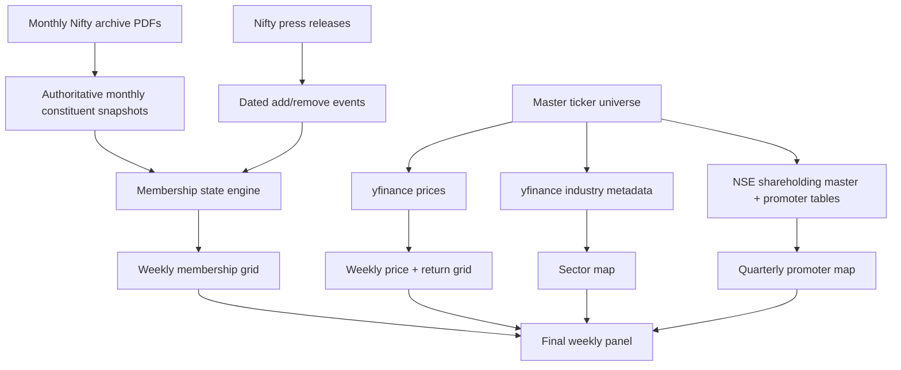
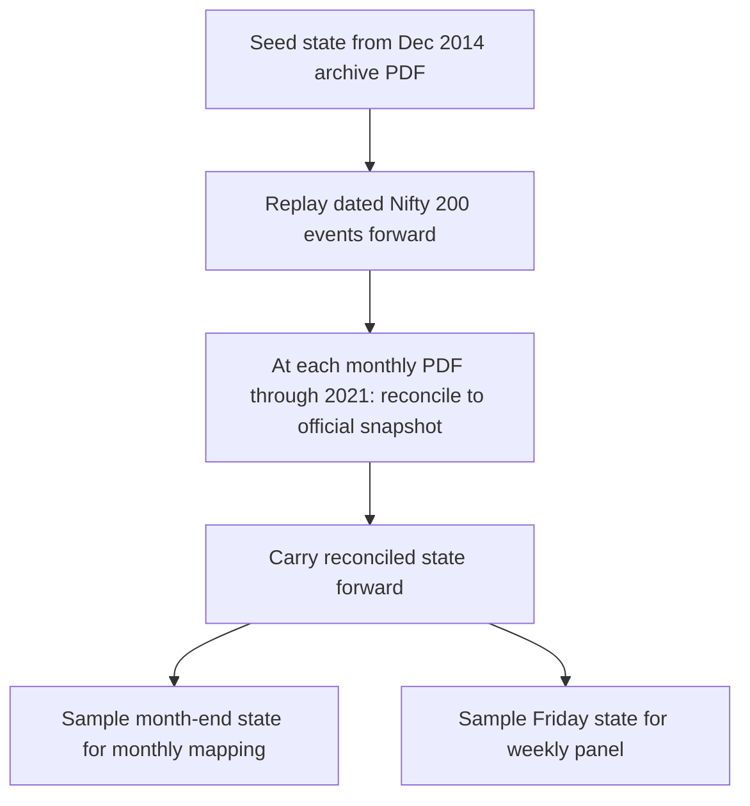
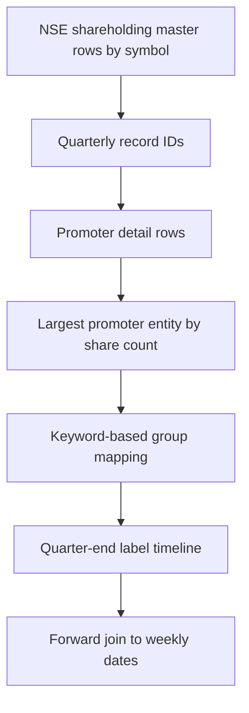

# Build Plan

## Objective

Construct a weekly long-format panel for the Nifty 200 covering 2015-01-02 through 2025-12-26 with point-in-time membership, prices, sector mappings, and promoter-group labels.

## Source strategy

1. Use monthly Nifty archive PDFs as authoritative constituent snapshots through 2021.
2. Use official Nifty press releases as dated event logs for additions, exclusions, and demerger-related changes.
3. Use NSE shareholding-pattern APIs for quarter-end promoter entities and map them into group labels.
4. Use `yfinance` for price history and fine industry labels.

## Traceable task list

1. Build historical constituent extraction from archive PDFs.
2. Build press-release event extraction and replay state changes.
3. Compute monthly and weekly membership states.
4. Download price history and compute weekly returns.
5. Build sector mapping with official-source-first fallbacks.
6. Build promoter classification with point-in-time quarter joins.
7. Assemble final long panel and a written report.

## Architecture

## Membership reconstruction logic

## Promoter classification logic

## Assumptions

- The official Nifty archive PDFs are more authoritative than AMC portfolio disclosures for constituent history and are used because plain Nifty 200 index-fund disclosure history is sparse for parts of the requested window.
- Membership changes are applied on the effective date stated in the press release.
- Quarterly promoter labels take effect on the shareholding pattern date reported by NSE.
- If promoter history cannot be fetched or classified consistently for a ticker, that ticker is dropped from the final panel.
